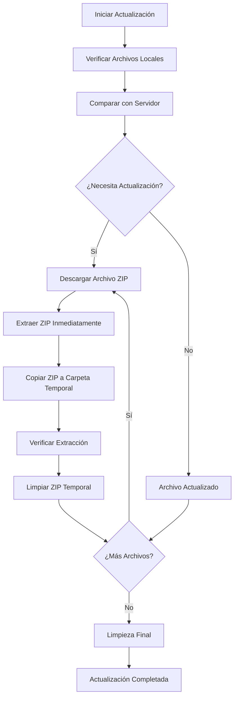

# 🎮 Launcher L2 Terra

Un launcher moderno y elegante para Lineage 2 Terra con funcionalidades avanzadas de descarga y actualización automática.

## ⚡ Comandos Rápidos

### 🚀 Desarrollo
```bash
npm run build:dev && npm start
```

### 🔧 Producción
```bash
npm run build:prod && npm run dist
```

### 🧹 Limpieza
```bash
npm run clean
```

## 📋 Tabla de Contenidos

- [🚀 Características](#-características)
- [📁 Estructura del Proyecto](#-estructura-del-proyecto)
- [🛠️ Instalación y Configuración](#️-instalación-y-configuración)
- [⚡ Comandos de Desarrollo](#-comandos-de-desarrollo)
- [🔧 Configuración del Entorno](#-configuración-del-entorno)
- [📦 Proceso de Build](#-proceso-de-build)
- [🎯 Flujo de Descarga e Instalación](#-flujo-de-descarga-e-instalación)
- [🐛 Solución de Problemas](#-solución-de-problemas)
- [📊 Monitoreo y Logs](#-monitoreo-y-logs)

## 🚀 Características

### ✨ Funcionalidades Principales
- **Descarga automática de parches**: Descarga archivos ZIP desde el servidor
- **Extracción automática**: Descomprime automáticamente en la carpeta de destino
- **Gestión inteligente de archivos**: Mueve ZIPs a carpeta temporal durante el proceso
- **Limpieza automática**: Elimina archivos temporales al finalizar
- **Interfaz moderna**: Diseño elegante con animaciones y efectos visuales

### 📊 Sistema de Progreso
- **Barra de progreso de descarga**: Muestra progreso de descarga por archivo
- **Barra de progreso de extracción**: Muestra progreso de extracción por archivo
- **Progreso total**: Barra principal con progreso general del proceso
- **Información detallada**: Nombre del archivo, porcentaje y estado actual

### 🔄 Proceso Optimizado
1. **Verificación**: Compara archivos locales con servidor
2. **Descarga**: Descarga solo archivos que necesitan actualización
3. **Extracción**: Extrae cada archivo inmediatamente después de descargarlo
4. **Gestión**: Mueve ZIPs a carpeta temporal durante el proceso
5. **Limpieza**: Elimina archivos temporales al finalizar

## 📁 Estructura del Proyecto

```
game_launcher_l2/
├── 📁 src/
│   ├── 📁 environments/
│   │   └── enviroment.js          # Configuración de entorno (dev/prod)
│   ├── 📁 scripts/
│   │   ├── patchDownloader.js     # Descargador de parches mejorado
│   │   ├── gameLauncher.js        # Lógica principal del launcher
│   │   ├── installer.js           # Instalador de archivos
│   │   ├── folderSelector.js      # Selector de carpetas
│   │   ├── externalLinks.js       # Manejo de enlaces externos
│   │   ├── rankingService.js      # Servicio de rankings
│   │   └── renderer.js            # Lógica del renderer process
│   ├── 📁 assets/
│   │   ├── 📁 images/
│   │   │   ├── 📁 backgrounds/    # Imágenes de fondo
│   │   │   ├── 📁 icons/          # Iconos de la aplicación
│   │   │   ├── 📁 logos/          # Logos de Terra
│   │   │   └── 📁 videos/         # Videos y animaciones
│   │   ├── 📁 styles/
│   │   │   └── style.css          # Estilos principales
│   │   ├── 📁 fonts/              # Fuentes personalizadas
│   │   └── 📁 views/
│   │       └── error.html         # Página de error personalizada
│   └── preload.js                 # APIs de Electron (preload)
├── 📁 dist/                       # Archivos compilados (generado)
├── 📁 node_modules/               # Dependencias (generado)
├── main.js                        # Proceso principal de Electron
├── index.html                     # Interfaz principal
├── splash.html                    # Pantalla de carga
├── webpack.config.dev.js          # Configuración Webpack desarrollo
├── webpack.config.prod.js         # Configuración Webpack producción
├── package.json                   # Configuración del proyecto
├── package-lock.json              # Lock de dependencias
├── clean.bat                      # Script de limpieza para Windows
├── .gitignore                     # Archivos ignorados por Git
├── LICENSE                        # Licencia del proyecto
└── README.md                      # Este archivo
```

## 🛠️ Instalación y Configuración

### Requisitos Previos
- **Node.js**: Versión 16 o superior
- **npm**: Gestor de paquetes de Node.js
- **Windows**: 10/11 (para extracción con 7-Zip o PowerShell)
- **Git**: Para clonar el repositorio

### Instalación Paso a Paso

```bash
# 1. Clonar el repositorio
git clone <repository-url>
cd game_launcher_l2

# 2. Instalar dependencias
npm install

# 3. Probar en desarrollo
npm run build:dev
npm start

# 4. Crear ejecutable (opcional)
npm run build:prod
npm run dist
```

### Configuración del Entorno

El proyecto utiliza variables de entorno para diferenciar entre desarrollo y producción:

- **Desarrollo**: `NODE_ENV=development`
- **Producción**: `NODE_ENV=production`

## ⚡ Comandos de Desarrollo

### 🚀 Flujo de Desarrollo

```bash
# 1. Limpiar archivos compilados
rm -rf dist/ renderer.bundle.js styles.css assets/ views/ preload.js *.png *.ttf *.woff2

# 2. Compilar para desarrollo
npm run build:dev

# 3. Ejecutar en modo desarrollo
npm start

# 4. Modo watch (opcional - recompila automáticamente)
npm run watch
```

### 🔧 Flujo de Producción

```bash
# 1. Limpiar archivos compilados
rm -rf dist/ renderer.bundle.js styles.css assets/ views/ preload.js *.png *.ttf *.woff2

# 2. Compilar para producción
npm run build:prod

# 3. Crear instalador Windows
npm run dist
```

### 🧹 Comandos de Limpieza

```bash
# Limpiar todo (desarrollo y producción)
npm run clean

# Limpiar manualmente
rm -rf dist/ renderer.bundle.js styles.css assets/ views/ preload.js *.png *.ttf *.woff2
```

### 🧹 Comandos de Limpieza

```bash
# Limpiar carpeta dist
npm run clean

# Usar script de limpieza (Windows)
.\clean.bat
```

## 🔧 Configuración del Entorno

### Archivo `src/environments/enviroment.js`

```javascript
// Configuración automática basada en NODE_ENV
const isProduction = process.env.NODE_ENV === 'production';

export const environment = {
  production: isProduction,
  // API para rankings (PvP/PK)
  apiUrl: isProduction ? 'https://api.l2terra.online' : 'http://localhost:8080',
  // API para descargas de archivos
  downloadUrl: 'https://patch.l2terra.online'
};
```

### APIs del Sistema

El launcher utiliza **2 APIs diferentes**:

1. **📊 API de Rankings** (`environment.apiUrl`):
   - **Desarrollo**: `http://localhost:8080`
   - **Producción**: `https://api.l2terra.online`
   - **Uso**: Rankings PvP/PK, estadísticas del servidor

2. **📦 API de Descargas** (`environment.downloadUrl`):
   - **URL**: `https://patch.l2terra.online`
   - **Uso**: Descarga de archivos ZIP, parches del juego
   - **Comunicación**: Con `index.php` del servidor

### Configuración de Webpack

#### `webpack.config.dev.js` (Desarrollo)
- **Modo**: `development`
- **Output**: Raíz del proyecto
- **Devtool**: `source-map`
- **Clean**: `false`

#### `webpack.config.prod.js` (Producción)
- **Modo**: `production`
- **Output**: Carpeta `dist/`
- **Devtool**: `false`
- **Clean**: `true`
- **Plugins personalizados**: Copia `main.js` sin procesar
- **Assets**: Copia archivos estáticos automáticamente

## 📦 Proceso de Build

### Flujo de Build Completo

1. **Webpack Compilation**:
   ```bash
   npm run build:prod
   ```
   - Compila JavaScript y CSS
   - Copia archivos estáticos a `dist/`
   - Copia `main.js` sin procesar
   - Crea `package.json` simplificado en `dist/`
   - Copia módulo `electron` a `dist/node_modules/`

2. **Electron Builder**:
   ```bash
   npm run dist
   ```
   - Ejecuta `electron-builder` desde `dist/`
   - Crea instalador NSIS para Windows
   - Genera `app.asar` con todos los archivos

### Estructura del Build Final

```
dist/
├── main.js                    # Proceso principal (sin procesar)
├── package.json               # Configuración para electron-builder
├── node_modules/electron/     # Módulo electron copiado
├── index.html                 # Interfaz principal
├── splash.html                # Pantalla de carga
├── preload.js                 # Script de preload
├── renderer.bundle.js         # JavaScript compilado
├── styles.css                 # CSS compilado
└── static/                    # Archivos estáticos
    ├── assets/
    ├── css/
    ├── fonts/
    └── views/
```

## 🎯 Flujo de Descarga e Instalación

### Proceso de Actualización



### Flujo Paso a Paso

1. **Descarga**: Se descarga el archivo ZIP desde el servidor
2. **Extracción**: Se extrae inmediatamente el contenido del ZIP
3. **Copia**: Se copia el ZIP a carpeta temporal para organización
4. **Verificación**: Se verifica que la extracción fue exitosa
5. **Limpieza**: Se elimina el ZIP temporal
6. **Siguiente**: Se repite para el siguiente archivo

### Detalles del Proceso

1. **Verificación Inicial**:
   - Compara tamaños de archivos locales
   - Verifica fechas de modificación
   - Identifica archivos que necesitan actualización

2. **Descarga Inteligente**:
   - Descarga archivos ZIP uno por uno
   - Muestra progreso de descarga en tiempo real
   - Maneja errores con reintentos automáticos

3. **Extracción Inmediata**:
   - Extrae cada ZIP inmediatamente después de descargarlo
   - Usa 7-Zip si está disponible
   - Fallback a PowerShell si es necesario
   - Muestra progreso de extracción en tiempo real

4. **Gestión de Archivos**:
   - Copia ZIPs a carpeta `temp_download` para organización
   - Mantiene archivos organizados durante el proceso
   - Limpia archivos temporales al finalizar

## 🐛 Solución de Problemas

### Errores Comunes y Soluciones

#### ❌ Error: `ERR_FILE_NOT_FOUND`
**Causa**: Archivos no encontrados en desarrollo
**Solución**:
```bash
npm run clean
npm run build
npm start
```

#### ❌ Error: `EBUSY: resource busy or locked`
**Causa**: Proceso de Electron aún ejecutándose
**Solución**:
```bash
# Usar script de limpieza
.\clean.bat

# O manualmente
taskkill /f /im "Launcher-Terra.exe"
taskkill /f /im "electron.exe"
rmdir /s /q "dist"
```

#### ❌ Error: `Unable to load preload script`
**Causa**: `main.js` no encuentra archivos en producción
**Solución**:
```bash
npm run clean
npm run dist
```

#### ❌ Error: `Cannot compute electron version`
**Causa**: Módulo electron no encontrado
**Solución**:
```bash
npm install
npm run dist
```

### Verificación de Instalación

```bash
# Verificar que la aplicación se instala correctamente
npm run dist
# Instalar el .exe generado
# Verificar que abre sin errores
```

## 📊 Monitoreo y Logs

### Logs de Desarrollo

```bash
# Ver logs en tiempo real
npm start
# Abrir DevTools (F12) para ver logs detallados
```

### Logs de Producción

Los logs de producción se pueden encontrar en:
- **Windows**: `%APPDATA%\Launcher-L2-Terra\logs\`
- **Consola**: Abrir DevTools en la aplicación instalada

### Información de Debug

```javascript
// En la consola de desarrollador
console.log('Estado de descarga:', downloadStatus);
console.log('Progreso:', progress);
console.log('Errores:', errors);
```

## 🔒 Seguridad

### Autenticación
- **JWT Tokens**: Autenticación temporal con el servidor
- **Verificación de archivos**: Compara hashes y tamaños
- **Manejo seguro de errores**: No expone información sensible

### Validaciones
- **Verificación de permisos**: Comprueba permisos de escritura
- **Validación de rutas**: Previene path traversal
- **Sanitización de inputs**: Limpia entradas del usuario

## 🚀 Despliegue

### Crear Instalador

```bash
# Build completo y crear instalador
npm run dist

# El instalador se genera en:
# dist/Launcher-L2-Terra Setup 1.0.0.exe
```

### Distribución

1. **Build para producción**:
   ```bash
   npm run dist
   ```

2. **Instalador generado**:
   - Ubicación: `dist/Launcher-L2-Terra Setup 1.0.0.exe`
   - Tamaño: ~200MB (incluye Electron runtime)
   - Compatibilidad: Windows 10/11

3. **Instalación**:
   - Ejecutar como administrador
   - Instalación automática en `Program Files`
   - Acceso directo en escritorio

## 📝 Notas de Desarrollo

### Estructura de Archivos Clave

- **`main.js`**: Proceso principal de Electron
- **`webpack.config.dev.js`**: Configuración de build para desarrollo
- **`webpack.config.prod.js`**: Configuración de build para producción
- **`package.json`**: Scripts y dependencias
- **`src/environments/enviroment.js`**: Configuración de entorno
- **`src/scripts/renderer.js`**: Punto de entrada del renderer
- **`src/assets/styles/style.css`**: Estilos principales

### Variables de Entorno

- **`NODE_ENV`**: Controla modo dev/prod
- **`process.env.NODE_ENV`**: Disponible en código cliente

### Plugins de Webpack

- **`CopyWebpackPlugin`**: Copia archivos estáticos automáticamente
- **`MiniCssExtractPlugin`**: Extrae CSS a archivos separados
- **`webpack.DefinePlugin`**: Define variables de entorno
- **`CopyMainJs`**: Copia `main.js` sin procesar (solo producción)
- **`CreateDistPackageJson`**: Crea `package.json` en `dist` (solo producción)

## 🤝 Contribución

### Flujo de Desarrollo

1. **Fork del proyecto**
2. **Crear rama feature**: `git checkout -b feature/nueva-funcionalidad`
3. **Desarrollar**: Hacer cambios y commits
4. **Probar**: `npm start` y `npm run dist`
5. **Pull Request**: Enviar cambios para revisión

### Estándares de Código

- **JavaScript**: ES6+ con módulos
- **CSS**: Estilos modulares
- **HTML**: Semántico y accesible
- **Commits**: Mensajes descriptivos en español

---

**Desarrollado con ❤️ para la comunidad de Lineage 2 Terra**
