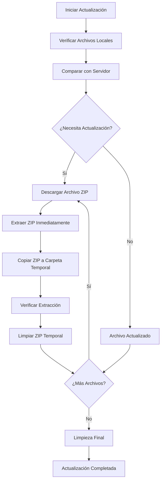

# 🎮 Launcher L2 Terra

Este launcher fue creado especialmente para el servidor privado Lineage 2 Terra.
<br>
<a href="https://l2terra.online" target="_blank" >https://l2terra.online</a>
<br>
Permite mantener el cliente siempre actualizado automáticamente con los últimos parches.Tambien muestra 2 tablas de rankings.


## 🚀 Comandos

```bash
# Desarrollo
npm start                   # Compila y ejecuta en desarrollo
npm run watch              # Modo watch (recompila automáticamente)
npm run clean              # Limpiar archivos compilados

# Producción
npm run build:prod         # Compilar para producción
npm run dist               # Crear instalador NSIS
npm run dist:inno          # Crear instalador Inno Setup
```

## 📋 Tabla de Contenidos

- [🎯 Características Principales](#-características-principales)
- [📁 Estructura del Proyecto](#-estructura-del-proyecto)
- [🛠️ Instalación y Configuración](#️-instalación-y-configuración)
- [⚡ Flujo de Desarrollo](#-flujo-de-desarrollo)
- [📦 Proceso de Build](#-proceso-de-build)
- [🎯 Flujo de Descarga e Instalación](#-flujo-de-descarga-e-instalación)
- [📊 Sistema de Rankings](#-sistema-de-rankings)
- [🔧 Configuración del Entorno](#-configuración-del-entorno)
- [📦 Instaladores](#-instaladores)


## 🎯 Características Principales

### ✨ Funcionalidades Core
- **Descarga automática de parches**: Descarga archivos ZIP desde el servidor
- **Extracción inteligente**: Descomprime automáticamente con 7-Zip o PowerShell
- **Gestión de archivos**: Mueve ZIPs a carpeta temporal durante el proceso
- **Limpieza automática**: Elimina archivos temporales al finalizar
- **Rankings en tiempo real**: Muestra top PvP y PK del servidor
- **Interfaz moderna**: Diseño elegante con animaciones y efectos visuales

### 📊 Sistema de Progreso
- **Barra de progreso principal**: Muestra progreso general del proceso
- **Información detallada**: Nombre del archivo, porcentaje y estado actual
- **Gestión inteligente**: Maneja descarga e instalación en una sola barra

## 📁 Estructura del Proyecto

```
game_launcher_l2/
├── 📁 src/
│   ├── 📁 environments/
│   │   └── enviroment.js          # Configuración de entorno (dev/prod)
│   ├── 📁 scripts/
│   │   ├── patchDownloader.js     # Descargador de parches mejorado
│   │   ├── gameLauncher.js        # Lógica principal del launcher
│   │   ├── installer.js           # Instalador de archivos
│   │   ├── folderSelector.js      # Selector de carpetas
│   │   ├── externalLinks.js       # Manejo de enlaces externos
│   │   ├── rankingService.js      # Servicio de rankings PvP/PK
│   │   └── renderer.js            # Punto de entrada del renderer
│   ├── 📁 assets/
│   │   ├── 📁 images/
│   │   │   ├── 📁 backgrounds/    # Imágenes de fondo
│   │   │   ├── 📁 icons/          # Iconos de la aplicación
│   │   │   ├── 📁 logos/          # Logos de Terra
│   │   │   └── 📁 videos/         # Videos y animaciones
│   │   ├── 📁 styles/
│   │   │   ├── style.css          # Estilos principales
│   │   │   └── fonts.css          # Fuentes personalizadas
│   │   └── 📁 fonts/              # Fuentes personalizadas
│   ├── 📁 views/
│   │   └── error.html             # Página de error personalizada
│   └── preload.js                 # APIs de Electron (preload)
├── 📁 build/                      # Archivos compilados (desarrollo)
├── 📁 dist/                       # Archivos compilados (producción)
├── main.js                        # Proceso principal de Electron
├── index.html                     # Interfaz principal
├── splash.html                    # Pantalla de carga
├── webpack.config.dev.js          # Configuración Webpack desarrollo
├── webpack.config.prod.js         # Configuración Webpack producción
├── installer.iss                  # Script de Inno Setup
├── package.json                   # Configuración del proyecto
└── README.md                      # Este archivo
```

## 🛠️ Instalación y Configuración

### Requisitos Previos
- **Node.js**: Versión 16 o superior
- **npm**: Gestor de paquetes de Node.js
- **Windows**: 10/11 (para extracción con 7-Zip o PowerShell)
- **Git**: Para clonar el repositorio

### Instalación

```bash
git clone <repository-url>
cd game_launcher_l2
npm install
```

## ⚡ Desarrollo

### 🚀 Flujo de Trabajo
1. **Instalar dependencias**: `npm install`
2. **Iniciar desarrollo**: `npm start`
3. **Modo watch**: `npm run watch` (recompila automáticamente)
4. **Limpiar**: `npm run clean` (cuando sea necesario)

### 🔧 Producción
1. **Compilar**: `npm run build:prod`
2. **Crear instalador**: `npm run dist` (NSIS) o `npm run dist:inno` (Inno Setup)

## 📦 Proceso de Build

### Estructura de Build

```
build/                          # Desarrollo
├── main.js
├── package.json
├── renderer.bundle.js
├── styles.css
├── preload.js
├── index.html
├── splash.html
├── assets/
└── views/

dist/                           # Producción
├── win-unpacked/              # Aplicación empaquetada
│   ├── Launcher Terra.exe
│   ├── resources/
│   └── locales/
└── Launcher Terra Setup 1.0.0.exe  # Instalador NSIS
```


## 🎯 Flujo de Descarga e Instalación

### Proceso de Actualización



### Detalles del Proceso

#### 1. **Verificación Inicial**
- Compara tamaños de archivos locales con servidor
- Verifica fechas de modificación
- Identifica archivos que necesitan actualización
- Genera hash único por carpeta para tracking

#### 2. **Descarga Inteligente**
- Descarga archivos ZIP uno por uno
- Muestra progreso de descarga en tiempo real
- Maneja errores con reintentos automáticos (3 intentos)
- Verifica espacio en disco antes de descargar

#### 3. **Extracción Inmediata**
- Extrae cada ZIP inmediatamente después de descargarlo
- Usa 7-Zip si está disponible (más rápido)
- Fallback a PowerShell si es necesario
- Muestra progreso de extracción en tiempo real

#### 4. **Gestión de Archivos**
- Copia ZIPs a carpeta `temp_download` para organización
- Mantiene archivos organizados durante el proceso
- Limpia archivos temporales al finalizar
- Maneja errores de permisos y espacio

### APIs Utilizadas

El launcher utiliza **2 APIs diferentes** configuradas en `src/environments/enviroment.js`:

#### 📊 API de Rankings (`environment.apiUrl`)
- **Desarrollo**: `http://localhost:8080`
- **Producción**: `https://tu-api-domain.com`
- **Funcionalidad**: Rankings PvP/PK, estadísticas del servidor

#### 📦 API de Descargas (`environment.downloadUrl`)
- **URL**: `https://tu-patch-domain.com`
- **Funcionalidad**: Descarga de archivos ZIP, parches del juego
- **Autenticación**: JWT tokens temporales

## 📊 Sistema de Rankings

### Funcionalidades

#### 🏆 Rankings PvP y PK
- **Actualización**: Cada 5 minutos automáticamente
- **Datos**: Posición, nombre del jugador, kills
- **Cache**: 5 minutos para evitar sobrecarga
- **Fallback**: Datos por defecto si la API falla

### Estructura de Datos

El sistema de rankings maneja datos de jugadores con posición, nombre y puntuación, obtenidos desde la API configurada en el environment.

### Cache y Rendimiento

- **Manejo de errores**: Datos por defecto si la API falla
- **Logs detallados**: Para debugging y monitoreo

## 🔧 Configuración del Entorno

### Archivo `src/environments/enviroment.js`

```javascript
// Configuración automática basada en NODE_ENV
const isProduction = process.env.NODE_ENV === 'production';

export const environment = {
  production: isProduction,
  // API para rankings (PvP/PK)
  apiUrl: isProduction ? 'https://tu-api-domain.com' : 'http://localhost:8080',
  // API para descargas de archivos
  downloadUrl: 'https://tu-patch-domain.com'
};
```


### Configuración de Webpack

- **Desarrollo**: `webpack.config.dev.js` - Modo development, source maps
- **Producción**: `webpack.config.prod.js` - Modo production, optimizado

## 📦 Instaladores

### NSIS (electron-builder)
```bash
npm run dist
```
- Generado automáticamente
- Ubicación: `dist/Launcher Terra Setup 1.0.0.exe`

### Inno Setup (Personalizado)
```bash
npm run dist:inno
```
- Script personalizado: `installer.iss`
- Ubicación: `../Launcher-Terra-Inno-Setup.exe`


**Desarrollado con ❤️ para la comunidad de Lineage 2 Terra**
